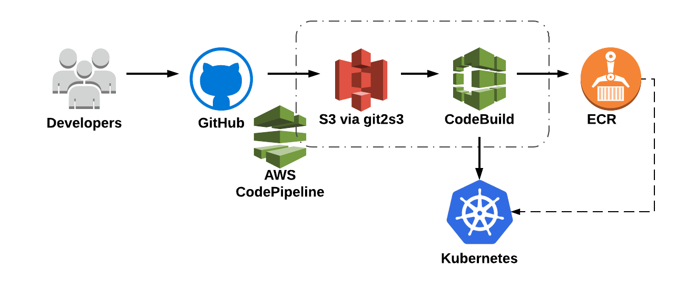

# infra

## Summary

This repository provides information about the infrastructure that supports our
[Identity and access management](https://github.com/mozilla-iam/mozilla-iam)
project.

## Architecure overview

### Code change to deployment



We have introduced some additional complexity not seen in this diagram. We are
using the wonderful
[git2s3](https://github.com/aws-quickstart/quickstart-git2s3) quickstart from
AWS to start our CodePipeline jobs when GitHub sends us a webhook. In order to
accomplish this, `git2s3` creates an API Gateway and utilizes Lambda functions
to receive the webhooks, clone the source repository and place the build
artifact in the S3 bucket seen in the diagram above. The Lambda function has
been modified to write each build artifact with the following object key naming
structure in S3:

```
/build_artifacts/${repository_owner}/${repository_name}.zip
```

The [CodePipeline for each
project](https://github.com/danielhartnell/aws-codepipeline-cloudformation) will
start when the object with that specific key name has been updated in S3.

### Working agreements

In May of 2018, we settled on several working agreements to define how we want
to work and what we want to use to build this infrastructure. I am sharing the
working agreements and their current status here.

#### Cluster and deployment architecture

| Component                                           | Status        |
| -------------                                       |:-------------:|
| Standardized code deployment                        | In progress   |
| Security parity with current deployments            | In progress   |
| Evaluation of TLS termination standard              | In progress   |
| Documenting process and setup clearly and concisely | In progress   |
| Cluster, container and network monitoring           | In progress   |

To provide a little more detail, we made agreements beyond each specific component that we need to build. We also agreed on tools, code deployment build steps and methods to approach each component build.

##### The methods

- We will consistently use CloudFormation to provision RDS, IAM Roles, CodeBuild, CodePipeline, and Serverless Functions
- We will use native AWS tools pragmatically
- We will maintain our own deployment of Kubernetes until EKS becomes available to the general public and reaches feature parity with our implementation
- In order to support the agreement above, we will use as much bare Kubernetes as possible to avoid locking ourselves into our implementation

##### The tools

###### Deployment

- Kubernetes installed with [kops](https://github.com/kubernetes/kops) through
  our [reference
implementation](https://github.com/mozilla-iam/kubernetes-deployment)
- Docker
- [CodePipeline and CodeBuild for
  CI/CD](https://github.com/danielhartnell/aws-codepipeline-cloudformation)
- [git2s3 AWS quickstart](https://github.com/aws-quickstart/quickstart-git2s3)
- ECR
- Helm

###### Logging and monitoring

- Prometheus through the CoreOS [Prometheus
  operator](https://github.com/coreos/prometheus-operator)
- Fluent daemonsets in Kubernetes to ship logs to CloudWatch
- Logs should be sent to MozDef
- VPC flow logs

###### Security

- Mig, auditd and [audisp-json](https://github.com/gdestuynder/audisp-json)
  running on each cluster instance
  - Nodes will get audisp-json and Mig using a hook the triggers SSM to run an ansible-playbook
- [CoreOS Clair](https://github.com/coreos/clair)
- AWS GuardDuty

##### Expected service deployment build steps

1. AWS CodePipeline will be triggered when code is merged into any branch in the source repository
2. The build job will use the `buildspec.yml` in the source repository
    1. Build the container with `docker build -t $TAG .`
    2. Scan the container image with [CoreOS Clair](https://github.com/coreos/clair)
    3. Run any other tests
    4. Render Helm templates in the source repository
    5. Validate the rendered Helm templates
    6. Push to ECR
    7. Run `kubectl` apply -f template
3. CodePipeline status updates can be sent to an SNS topic for notifications

### About this repository

This repository tracks all issues that do not have a GitHub repository assigned
(such as non-code, code without repo, etc.)

### Contact

For more information, please contact [Mozilla
Infosec](https://infosec.mozilla.org/) or the [Open Innovation
Team](https://wiki.mozilla.org/Innovation).
